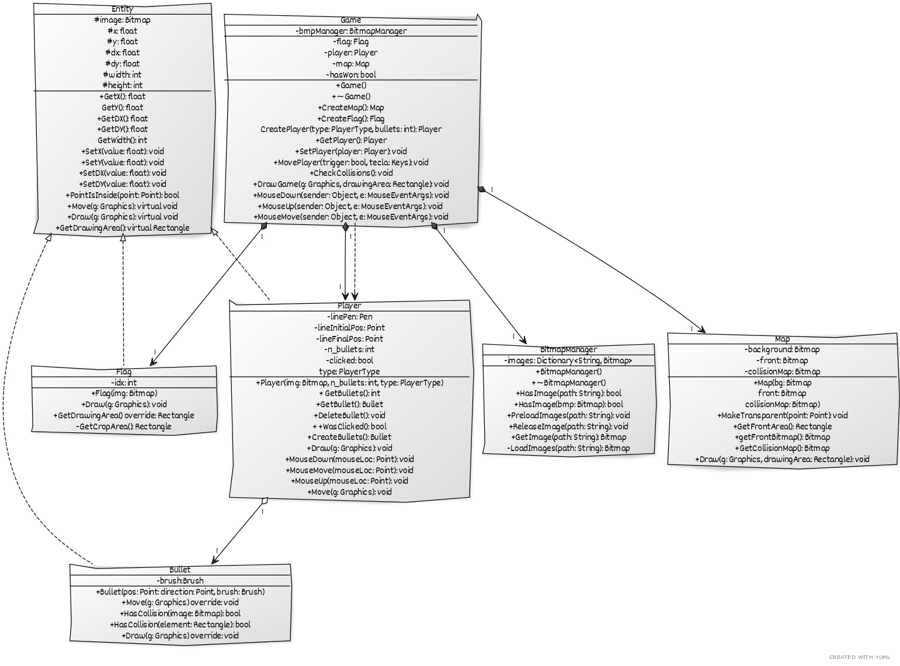

# Informe de la Práctica Calificada 2

## Integrantes del equipo

- Albitres Blondet, Diego
- Galindo Álvarez, Franco
- Izaguirre Braúl, Yamilé del Rocío
- Meneses Torres, Ángel Omar

## Demostración en video

En [YouTube](https://youtu.be/nr3XJNXofuY).

## Importante

El proyecto fue realizado utilizando **.NET Framework v4.8**. Es necesario tenerlo instalado para abrir el proyecto en Visual Studio. Se adjunta la configuración de instalación de Visual Studio en el archivo titulado `VS-Install-Config.vsconfig`.

## Ejecutable

Se adjunta en la carpeta `Release` un ejecutable listo para iniciar el programa. Alternativamente, se puede recompilar utilizando el código fuente también incluido.

## División del trabajo

_*Siendo muy sinceros, todos colaboramos con el trabajo del otro. En todo momento nos ayudamos mutuamente, ya que estuvimos las 12h aprox. en una conferencia virtual. Pero a continuación, se muestra a grandes rasgos las actividades realizadas.*_

### Diego (25%)

- Retoque de imágenes (Photoshop).
- Corrección de errores mayores en cada parte para evitar bugs.
- Implementación de la clase BitmapManager, Map, parte la lógica de Game.
- Optimización del código.

### Franco (25%)

- Implementación de Bullet
- Física e implementación del movimiento del proyectil.
- Creación de los Graphics y buffers.
- Aporte en Game.

### Yamilé (25%)

- Implementación de Flag, la transparencia del Map y las colisiones generales.
- Aporte en la implementación de Bullet.
- Apoyo en la clase controladora Game.
- Aporte en Bullet (validaciones).

### Ángel (25%)

- Diagrama de clases.
- Implementación de la clase Entidad, Player, parte de la lógica de Game.
- Corrección de bugs en el menú y algunas validaciones.
- Lógica matemática y cálculos necesarios para validar valores.

## Diagrama de clases

Realizado en [YUML](https://yuml.me/diagram/scruffy/class/draw).

<details>
<summary>Click para ver imagen y código</summary>



```txt
[Entity|#image: Bitmap;#x: float;#y: float;#dx: float;#dy: float; #width: int;#height: int|+GetX(): float;GetY(): float;+GetDX(): float;+GetDY(): float; GetWidth(): int; +SetX(value: float): void; +SetY(value: float): void; +SetDX(value: float): void; +SetDY(value: float): void; +PointIsInside(point: Point): bool; +Move(g: Graphics): virtual void; +Draw(g: Graphics): virtual void; +GetDrawingArea(): virtual Rectangle]

[Player|-linePen: Pen; -lineInitialPos: Point; -lineFinalPos: Point;-n_bullets: int; -clicked: bool; type: PlayerType| +Player(img: Bitmap, n_bullets: int,
type: PlayerType); + GetBullets(): int; +GetBullet(): Bullet; +DeleteBullet(): void; + +WasClicked(): bool; +CreateBullets(): Bullet; +Draw(g: Graphics): void; +MouseDown(mouseLoc: Point): void; +MouseMove(mouseLoc: Point): void; +MouseUp(mouseLoc: Point): void; +Move(g: Graphics): void]

[Flag| -idx: int| +Flag(img: Bitmap); +Draw(g: Graphics): void; +GetDrawingArea() override: Rectangle; -GetCropArea(): Rectangle;]

[Bullet|-brush:Brush |+Bullet(pos: Point: direction: Point, brush: Brush); +Move(g: Graphics) override: void; +HasCollision(image: Bitmap): bool; +HasCollision(element: Rectangle): bool;+Draw(g: Graphics) override: void]

[Map|-background: Bitmap; -front: Bitmap; -collisionMap: Bitmap| +Map(bg: Bitmap; front: Bitmap; collisionMap: Bitmap); +MakeTransparent(point: Point): void; +GetFrontArea(): Rectangle; +getFrontBitmap(): Bitmap; +GetCollisionMap(): Bitmap; +Draw(g: Graphics, drawingArea: Rectangle): void]

[Game|-bmpManager: BitmapManager| -flag: Flag; -player: Player; -map: Map; -hasWon: bool| +Game(); +~Game(); +CreateMap(): Map; +CreateFlag(): Flag; CreatePlayer(type: PlayerType
bullets: int): Player; +GetPlayer(): Player; +SetPlayer(player: Player): void; +MovePlayer(trigger: bool
tecla: Keys): void; +CheckCollisions(): void; +DrawGame(g: Graphics, drawingArea: Rectangle): void; +MouseDown(sender: Object
e: MouseEventArgs): void; +MouseUp(sender: Object
e: MouseEventArgs): void ; +MouseMove(sender: Object
e: MouseEventArgs): void]

[Entity]^-.-[Player]
[Entity]^-.-[Bullet]
[Entity]^-.-[Flag]

[Player]<>1-1>[Bullet]

[Game]++1-1>[Player]
[Game]++1-1>[Map]
[Game]++1-1>[Flag]
[Game]++1-1>[BitmapManager]
[Game]-.->[Player]

[BitmapManager| -images: Dictionary\<String, Bitmap\>|+BitmapManager(); +~BitmapManager(); +HasImage(path: String): bool; +HasImage(bmp: Bitmap): bool; +PreloadImages(path: String): void; +ReleaseImage(path: String): void; +GetImage(path: String): Bitmap; -LoadImages(path: String): Bitmap]
´´´
</details>
